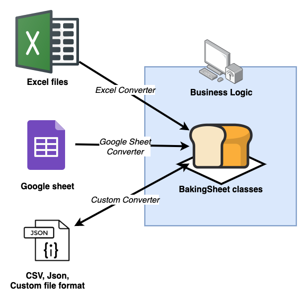
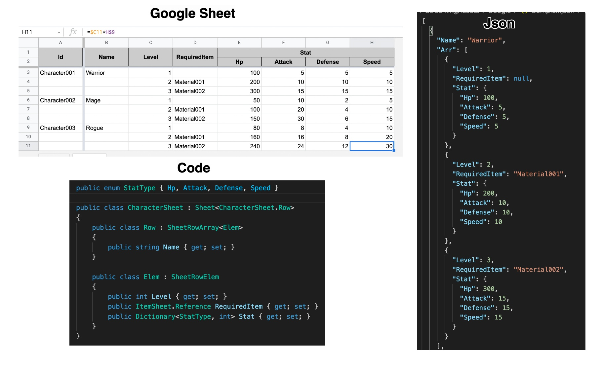
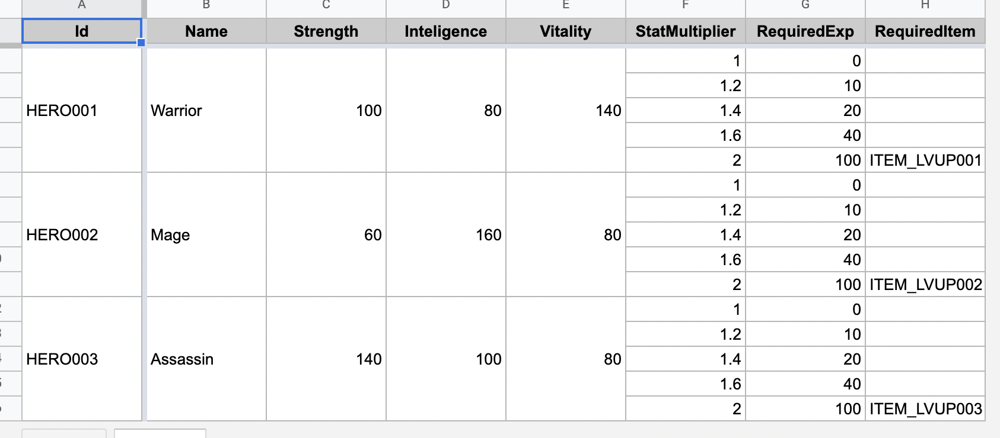

[](https://www.nuget.org/packages?q=BakingSheet) [](https://github.com/cathei/BakingSheet/releases) [](https://github.com/cathei/BakingSheet/blob/master/LICENSE) [](https://discord.gg/wXjxjfrDQa)

# BakingSheet
Easy datasheet management for C# and Unity. Supports Excel, Google Sheet, JSON and CSV format. It has been used for several mobile games that released on Google Play and AppStore.

## Concept
Throughout all stage of game development, you'll need to deal with various data. Characters, stats, stages, currencies and so on! If you're using Unity, scriptable object and inspector is not good enough for mass edition and lacks of features like functions or fill up. With BakingSheet your designers can use existing spreadsheet editor, while you, the programmer, can directly use C# object without messy parsing logics.



BakingSheet's core concept is controlling datasheet schema from C# code, make things flexible while supporting multiple sources like .xlsx or Google sheets. Also, you won't have to include source .xlsx files or parsing libraries for production builds. BakingSheet supports JSON serialization by default, you can ship your build with JSON or your custom format.

BakingSheet's basic workflow is like this:
1. Programmers make C# schema that represents Datasheet. (They can provide sample .xlsx or Google Sheet with headers.)
2. Designers fill up the Datasheet, using any powerful functions and features of spreadsheet.
3. Edit-time script converts Datasheet to JSON (or any custom format) with your C# schema and validates data.
4. Runtime script reads from JSON (or any custom format) with your C# schema.
5. Your business logic directly uses C# instace of your schema.
6. Profit!




## Features
* Easy-to-use Datasheet management.
* Define schema as C# classes - no messy metadata on your datasheet.
* Supports importing from Excel, Google sheet, CSV and JSON.
* Supports exporting to CSV and JSON.
* Supports .NET platforms and all Unity platforms.
* Powerful Cross-sheet reference feature.
* Customizable value verification - like checking prefab pathes.

## Install
Download with [NuGet](https://www.nuget.org/packages?q=BakingSheet) or download [.unitypackage release](https://github.com/cathei/BakingSheet/releases)

### Need help?
Before you start, I want to mention that if you have problem or need help, you can always ask me on [Discord Channel](https://discord.gg/wXjxjfrDQa)!

## First Step
BakingSheet manages datasheet schema as C# code. `Sheet` class represents a table and `SheetRow` class represents a record. Below is example content of file `Items.xlsx`. Also, any column starts with $ will be considered as comment and ignored.


<details>
<summary>Markdown version</summary>

| Id             | Name              | Price | $Comment   |
|----------------|-------------------|-------|------------|
| ITEM_LVUP001   | Warrior's Shield  | 10000 | Warrior Lv up material |
| ITEM_LVUP002   | Mage's Staff      | 10000 | Mage Lv up material |
| ITEM_LVUP003   | Assassin's Dagger | 10000 | Assassin Lv up material |
| ITEM_POTION001 | Health Potion     | 30    | Heal 20 Hp |
| ITEM_POTION002 | Mana Potion       | 50    | Heal 20 Mp |
</details>

Code below is corresponding BakingSheet class.
```csharp
public class ItemSheet : Sheet<ItemSheet.Row>
{
    public class Row : SheetRow
    {
        // use name of matching column
        public string Name { get; private set; }
        public int Price { get; private set; }
    }
}
```
Note that `Id` column is already defined in base `SheetRow` class.

To represent collection of sheets, implement `SheetContainerBase` class.
```csharp
public class SheetContainer : SheetContainerBase
{
    public SheetContainer(Microsoft.Extensions.Logging.ILogger logger) : base(logger) {}

    // use name of each matching sheet name from source
    public ItemSheet Items { get; private set; }

    // add other sheets right here
    // public CharacterSheet Characters { get; private set; }
}
```

## Converters
Converters are simple implementation import/export records from datasheet sources. These come as separated library, as it's user's decision to select datasheet source.
User can have converting process, to convert datasheet to other format ahead of time and not include heavy converters in production applications.

BakingSheet supports four basic converters. They're included in .unitypackage as well.
| Package Name                  | Format                       | Supports Import | Supports Export |
|-------------------------------|------------------------------|-----------------|-----------------|
| [BakingSheet.Converters.Excel](https://www.nuget.org/packages/BakingSheet.Converters.Excel/)  | Microsoft Excel              | O               | X               |
| [BakingSheet.Converters.Google](https://www.nuget.org/packages/BakingSheet.Converters.Google/) | Google Sheet                 | O               | X               |
| [BakingSheet.Converters.Csv](https://www.nuget.org/packages/BakingSheet.Converters.Csv/)    | Comma-Separated Values (CSV) | O               | O               |
| [BakingSheet.Converters.Json](https://www.nuget.org/packages/BakingSheet.Converters.Json/)   | JSON                         | O               | O               |

Below code shows how to convert .xlsx files from `Excel/Files/Path` directory.
```csharp
// pass logger to receive logs
var sheetContainer = new SheetContainer(logger);

// create excel converter from path
var excelConverter = new ExcelSheetConverter("Excel/Files/Path", TimeZoneInfo.Utc);

// bake sheets from excel converter
await sheetContainer.Bake(excelConverter);
```

For Google Sheet, first create your service account through Google API Console. Then add it to your sheet with READ permission. Use Google credential for that service account to create converter.
```csharp
// replace with your Google sheet identifier
// https://developers.google.com/sheets/api/guides/concepts
string googleSheetId = "1iWMZVI4FgtGbig4EgPIun_BRbzp4ulqRIzINZQl-AFI";

// service account credential than can read the sheet you're converting
// this starts with { "type": "service_account", "project_id": ...
string googleCredential = File.ReadAllText("Some/Path/Credential.json");

var googleConverter = new GoogleSheetConverter(googleSheetId, googleCredential, TimeZoneInfo.Utc);

// bake sheets from google converter
await sheetContainer.Bake(googleConverter);
```

## Save and Load Converted Datasheet
Below code shows how to load sheet from Excel and save as JSON. This typically happens through Unity Editor script or any pre-build time script.

```csharp
// create excel converter from path
var excelConverter = new ExcelSheetConverter("Excel/Files/Path", TimeZoneInfo.Utc);

// create json converter from path
var jsonConverter = new JsonSheetConverter("Json/Files/Path");

// convert from excel
await sheetContainer.Bake(excelConverter);

// save as json
await sheetContainer.Store(jsonConverter);
```

Then, for runtime you can load your data from JSON.

```csharp
// create json converter from path
var jsonConverter = new JsonSheetConverter("Json/Files/Path");

// load from json
await sheetContainer.Bake(jsonConverter);
```

You can extend `JsonSheetConverter` to customize serialization process. For example encrypting data or prettifying JSON. If you are using `StreamingAssets`, see [Reading From StreaminAssets](#reading-from-streamingassets).

## Accessing Row
Below code shows how to access specific `ItemSheet.Row`.
```csharp
var row = sheetContainer.Items["ITEM_LVUP003"];

// Assassin's dagger
logger.LogInformation(row.Name);
```

`Sheet<T>` is `KeyedCollection<T>`, you can loop through it and order is guaranteed to be same as spreadsheet.

```csharp
// loop through all rows
foreach (var row in sheetContainer.Items)
    logger.LogInformation(row.Name);
```

## Using Non-String Column as Id
Any type can be used value can be also used as `Id`. This is possible as passing type argument to generic class `SheetRow<TKey>` and `Sheet<TKey, TRow>`. Below is example content of file `Contstants.xlsx`.


<details>
<summary>Markdown version</summary>

| Id             | Value                                 |
|----------------|---------------------------------------|
| ServerAddress  | https://github.com/cathei/BakingSheet |
| InitialGold    | 1000                                  |
| CriticalChance | 0.1                                   |
</details>

Below code shows how to use enumeration type as Id.
```csharp
public enum GameConstant
{
    ServerAddress,
    InitialGold,
    CriticalChance,
}

public class ConstantSheet : Sheet<GameConstant, ConstantSheet.Row>
{
    public class Row : SheetRow<GameConstant>
    {
        public string Value { get; private set; }
    }
}
```

## Using Post Load Hook
You can override `PostLoad` method of `Sheet`, `SheetRow` or `SheetRowElem` to execute post load process.

Below code shows how to convert loaded sheet value dynamically.
```csharp
public class ConstantSheet : Sheet<GameConstant, ConstantSheet.Row>
{
    public class Row : SheetRow<GameConstant>
    {
        public string Value { get; private set; }

        private int valueInt;
        public int ValueInt => valueInt;

        private float valueFloat;
        public float ValueFloat => valueFloat;

        public override void PostLoad(SheetConvertingContext context)
        {
            base.PostLoad(context);

            int.TryParse(Value, out valueInt);
            float.TryParse(Value, out valueFloat);
        }
    }

    public string GetString(GameConstant key)
    {
        return Find(key).Value;
    }

    public int GetInt(GameConstant key)
    {
        return Find(key).ValueInt;
    }

    public float GetFloat(GameConstant key)
    {
        return Find(key).ValueFloat;
    }
}
```
Note that properties without setter are not serialized. Alternatively you can use `[NonSerialized]` attribute.

## Using List Column
List columns are used for simple array.


<details>
<summary>Flat header</summary>

| Id         | Name          | Monsters:1 | Monsters:2 | Monsters:3 | Items:1        | Items:2      |
| ---------- | ------------- | ---------- | ---------- | ---------- | -------------- | ------------ |
| DUNGEON001 | Easy Field    | MONSTER001 |            |            | ITEM_POTION001 | ITEM_LVUP001 |
| DUNGEON002 | Expert Zone   | MONSTER001 | MONSTER002 |            | ITEM_POTION002 | ITEM_LVUP002 |
| DUNGEON003 | Dragon’s Nest | MONSTER003 | MONSTER004 | MONSTER005 | ITEM_LVUP003   |              |
</details>

<details>
<summary>Split header</summary>

| Id         | Name          | Monsters   |            |            | Items          |              |
|------------|---------------|------------|------------|------------|----------------|--------------|
|            |               | 1          | 2          | 3          | 1              | 2            |
| DUNGEON001 | Easy Field    | MONSTER001 |            |            | ITEM_POTION001 | ITEM_LVUP001 |
| DUNGEON002 | Expert Zone   | MONSTER001 | MONSTER002 |            | ITEM_POTION002 | ITEM_LVUP002 |
| DUNGEON003 | Dragon’s Nest | MONSTER003 | MONSTER004 | MONSTER005 | ITEM_LVUP003   |              |
</details>

```csharp
public class DungeonSheet : Sheet<DungeonSheet.Row>
{
    public class Row : SheetRow
    {
        public string Name { get; private set; }

        public List<MonsterSheet.Reference> Monsters { get; private set; }
        public List<ItemSheet.Reference> Items { get; private set; }
    }
}
```
Use it as simple as just including a column has type implmenting `IList<T>`. Since spreadsheet is designer's area, index on sheet is 1-based. So be aware when you access it from code.

Also you can pick between flat-header style(`Monsters:1`) and split-header style(`Monsters`, `1`) as the example shows. There is no problem to mix-and-match or nest them.

## Using Dictionary Column
Dictionary columns are used when key-based access of value is needed.


<details>
<summary>Flat header</summary>

| Id     | Name          | Texts:Greeting    | Texts:Purchasing | Texts:Leaving     |
| ------ | ------------- | ----------------- | ---------------- | ----------------- |
| NPC001 | Fat Baker     | Morning traveler! | Thank you!       | Come again!       |
| NPC002 | Blacksmith    | G'day!            | Good choice.     | Take care.        |
| NPC003 | Potion Master | What do you want? | Take it already. | Don't come again. |
</details>

<details>
<summary>Split header</summary>

| Id     | Name          | Texts             |                  |                   |
|--------|---------------|-------------------|------------------|-------------------|
|        |               | Greeting          | Purchasing       | Leaving           |
| NPC001 | Fat Baker     | Morning traveler! | Thank you!       | Come again!       |
| NPC002 | Blacksmith    | G'day!            | Good choice.     | Take care.        |
| NPC003 | Potion Master | What do you want? | Take it already. | Don't come again. |
</details>

```csharp
public enum Situation
{
    Greeting,
    Purchasing,
    Leaving
}

public class NpcSheet : Sheet<NpcSheet.Row>
{
    public class Row : SheetRow
    {
        public string Name { get; private set; }

        public Dictionary<Situation, string> Texts { get; private set; }
    }
}
```
Use it as simple as just including a column has type implmenting `IDictionary<TKey, TValue>`.

## Using Nested Type Column
Nested type columns are used for complex structure.


<details>
<summary>Flat header</summary>

| Id     | Name          | Texts:Greeting    | Texts:Purchasing | Texts:Leaving     |
| ------ | ------------- | ----------------- | ---------------- | ----------------- |
| NPC001 | Fat Baker     | Morning traveler! | Thank you!       | Come again!       |
| NPC002 | Blacksmith    | G'day!            | Good choice.     | Take care.        |
| NPC003 | Potion Master | What do you want? | Take it already. | Don't come again. |
</details>

<details>
<summary>Split header</summary>

| Id     | Name          | Texts             |                  |                   |
|--------|---------------|-------------------|------------------|-------------------|
|        |               | Greeting          | Purchasing       | Leaving           |
| NPC001 | Fat Baker     | Morning traveler! | Thank you!       | Come again!       |
| NPC002 | Blacksmith    | G'day!            | Good choice.     | Take care.        |
| NPC003 | Potion Master | What do you want? | Take it already. | Don't come again. |
</details>

```csharp
public struct SituationText
{
    public string Greeting { get; private set; }
    public string Purchasing { get; private set; }
    public string Leaving { get; private set; }
}

public class NpcSheet : Sheet<NpcSheet.Row>
{
    public class Row : SheetRow
    {
        public string Name { get; private set; }

        public SituationText Texts { get; private set; }
    }
}
```
Note that the content of datasheet is just same as when using Dictionary column. The data type of column determines how BakingSheet reads the column.

## Using Row Array
Row arrays are used for 2-dimentional structure. Below is example content of file `Heroes.xlsx`.



<details>
<summary>Markdown version</summary>

| Id      | Name     | Strength | Inteligence | Vitality | StatMultiplier | RequiredExp | RequiredItem |
|---------|----------|----------|-------------|----------|----------------|-------------|--------------|
| HERO001 | Warrior  | 100      | 80          | 140      | 1              | 0           |              |
|         |          |          |             |          | 1.2            | 10          |              |
|         |          |          |             |          | 1.4            | 20          |              |
|         |          |          |             |          | 1.6            | 40          |              |
|         |          |          |             |          | 2              | 100         | ITEM_LVUP001 |
| HERO002 | Mage     | 60       | 160         | 80       | 1              | 0           |              |
|         |          |          |             |          | 1.2            | 10          |              |
|         |          |          |             |          | 1.4            | 20          |              |
|         |          |          |             |          | 1.6            | 40          |              |
|         |          |          |             |          | 2              | 100         | ITEM_LVUP002 |
| HERO003 | Assassin | 140      | 100         | 80       | 1              | 0           |              |
|         |          |          |             |          | 1.2            | 10          |              |
|         |          |          |             |          | 1.4            | 20          |              |
|         |          |          |             |          | 1.6            | 40          |              |
|         |          |          |             |          | 2              | 100         | ITEM_LVUP003 |
</details>

Rows without `Id` is considered as part of previous row. You can merge the non-array cells to make it visually intuitive. Below corresponding code shows how to define row arrays.

```csharp
public class HeroSheet : Sheet<HeroSheet.Row>
{
    public class Row : SheetRowArray<Elem>
    {
        public string Name { get; private set; }

        public int Strength { get; private set; }
        public int Inteligence { get; private set; }
        public int Vitality { get; private set; }

        public Elem GetLevel(int level)
        {
            return this[level - 1];
        }
    }

    public class Elem : SheetRowElem
    {
        public float StatMultiplier { get; private set; }
        public int RequiredExp { get; private set; }
        public string RequiredItem { get; private set; }
    }
}
```
Note that `SheetRowArray<TElem>` is implementing `IEnumerable<TElem>` and indexer.

It is worth mention you can use `VerticalList<T>` to cover the case you need multiple list of different length in one column. Though I recommend to split the sheet in that case if possible.

## Using Cross-Sheet Reference
Below code shows how to replace `string RequiredItem` to `ItemSheet.Reference RequiredItem` to add extra reliablity. `Sheet<TKey, TRow>.Reference` type is serialized as `TKey`, and verifies that row with same id exists in the sheet.

```csharp
public class HeroSheet : Sheet<HeroSheet.Row>
{
    public class Row : SheetRowArray<Elem>
    {
        // ...
    }

    public class Elem : SheetRowElem
    {
        public float StatMultiplier { get; private set; }
        public int RequiredExp { get; private set; }
        public ItemSheet.Reference RequiredItem { get; private set; }
    }
}
```

```csharp
public class SheetContainer : SheetContainerBase
{
    // ...

    // use name of each matching sheet name from source
    public HeroSheet Heroes { get; private set; }
    public ItemSheet Items { get; private set; }
}
```
Note that both `ItemSheet` and `HeroSheet` have to be one of the properties on same `SheetContainer` class.

## Custom Converters
User can create and customize their own converter by implementing `ISheetImporter` and `ISheetExporter`. Or you can inherit `JsonSheetConverter` and override methods like `GetSettings()` to customize serialization process.

## Custom Verifiers
You can verify datasheet sanity with custom verifiers. For example, you can define `ResourceAttribute` to mark columns that should reference path inside of Unity's Resources folder.

```csharp
public class ResourceAttribute : SheetAssetAttribute
{
    public ResourceAttribute() { }
}

public class PrefabSheet : Sheet<PrefabSheet.Row>
{
    public class Row : SheetRowArray<Elem>
    {
        [Resource] public string Path { get; private set; }
    }
}

// this is the part depends on Unity
public class ResourceVerifier : SheetVerifier<ResourceAttribute, string>
{
    // any string column with ResourceAttribute will be passed through the verify process
    // return value is the error string
    public override string Verify(ResourceAttribute attribute, string path)
    {
        if (string.IsNullOrEmpty(path))
            return null;

        var obj = Resources.Load(path);
        if (obj != null)
            return null;

        return $"Resource {path} not found!";
    }
}
```

Then, you can call `SheetContainerBase.Verify` after loading your sheet.
```csharp
sheetContainer.Verify(new ResourceVerifier() /*, new OtherVerifier()... */);
```

## Reading from StreamingAssets
If you are using `StreamingAssets` folder, it is required to implement own `IFileSystem` to read files from compressed `jar`. I would recommend combination with [BetterStreamingAsset](https://github.com/gwiazdorrr/BetterStreamingAssets). Below is example `IFileSystem` implemented through it.

```csharp
public class StreamingAssetFileSystem : IFileSystem
{
    public StreamingAssetFileSystem()
        => BetterStreamingAssets.Initialize();

    public bool Exists(string path)
        => BetterStreamingAssets.FileExists(path);

    public IEnumerable<string> GetFiles(string path, string extension)
        => BetterStreamingAssets.GetFiles(path, $"*.{extension}");

    public Stream OpenRead(string path)
        => BetterStreamingAssets.OpenRead(path);

    // write access to streaming assets is not allowed
    public Stream OpenWrite(string path)
        => throw new System.NotImplementedException();
}
```

You can pass it as parameter of `JsonSheetConverter` at runtime.

```csharp
// create json converter from path
var jsonConverter = new JsonSheetConverter("Json/Files/Path", new StreamingAssetFileSystem());

// load from json
await sheetContainer.Bake(jsonConverter);
```
