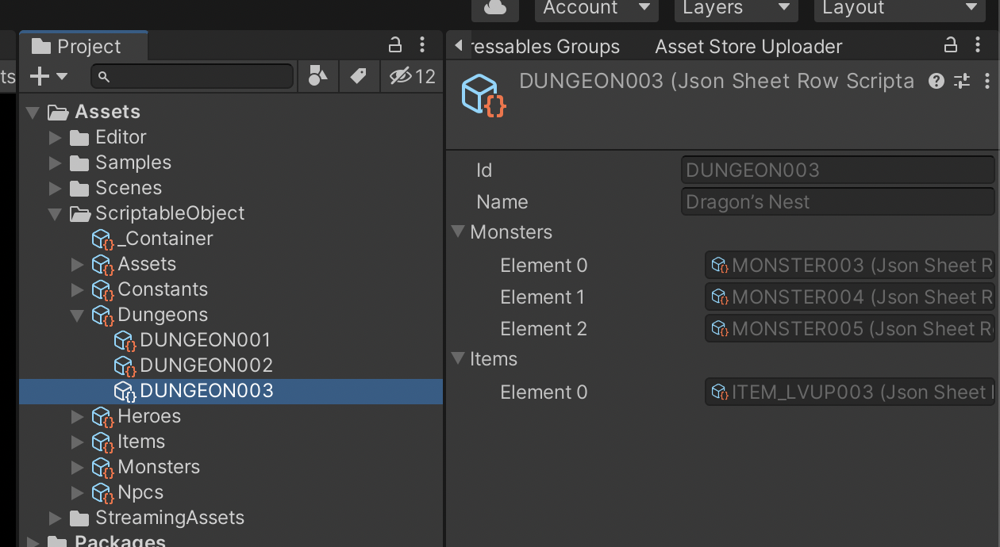
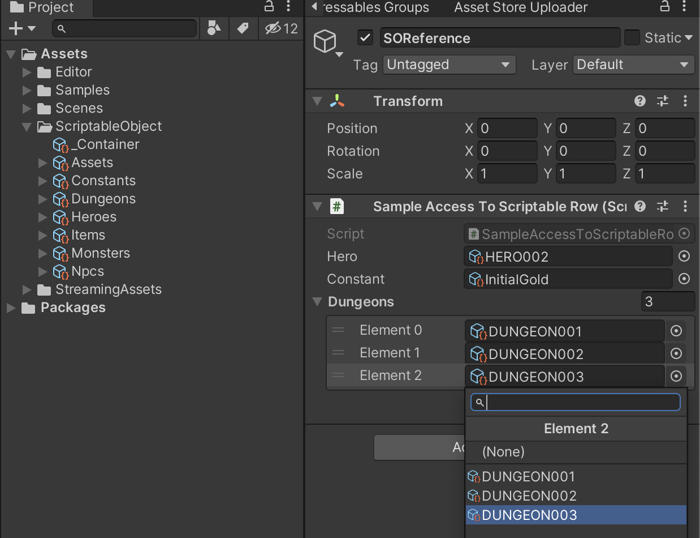
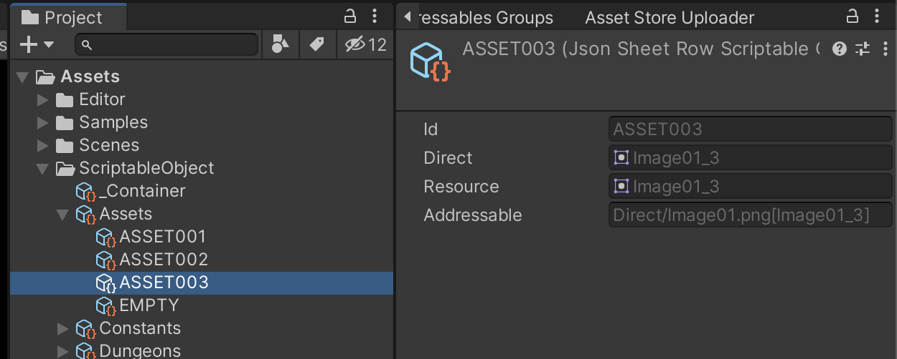

# Scriptable Object Converter
This document will explain about how to export and import Unity's Scriptable Object. For general information, see the [Repository's README](../README.md).

## Concept
ScriptableObject exporter and importer uses Unity's ScriptableObject asset as data container.
So you can inspect the data, reference specific row from MonoBehaviour, or even make it Addressable.

## Exporting Scriptable Object
You can create ScriptableObject assets using `ScriptableObjectExporter`.
The path is the base path of ScriptableObject will be saved, relative to project path.
```csharp
var exporter = new ScriptableObjectSheetExporter("Assets/ScriptableObject");

await sheetContainer.Store(exporter);
```
You can inspect each row from Unity's inspector.


## Importing Scriptable Object
You can import from ScriptableObject assets using `ScriptableObjectImporter`. A reference to `SheetContainerScriptableObject` is required.
```csharp
public class SheetManager : MonoBehaviour
{
    private SheetContainer container;
    public SheetContainerScriptableObject containerSO;

    public async void Start()
    {
        var importer = new ScriptableObjectSheetImporter(containerSO);

        container = new SheetContainer(UnityLogger.Default);
        await container.Bake(importer);
    }
}
```
You can drag-drop `_Container` ScriptableObject to your `SheetManager` component.

## Referencing Scriptable Object
You can use `Sheet.Reference` (Same as cross-sheet reference) to reference specific Row from inspector.

```csharp
public class SampleAccessToScriptableRow : MonoBehaviour
{
    public HeroSheet.Reference hero;
    public ConstantSheet.Reference constant;
    public List<DungeonSheet.Reference> dungeons;

    public void Awake()
    {
        Debug.Log(hero.Ref.Name);
        Debug.Log(constant.Ref.ValueInt);

        foreach (var dungeon in dungeons)
        {
            foreach (var item in dungeon.Ref.Items)
                Debug.Log(item.Ref.Name);
        }
    }
}
```

Note that while you can reference value of each row with this way, `PostLoad` will not be called until you import container with `ScriptableObjectImporter`.

## Using DirectAssetPath
`DirectAssetPath` will be automatically converted to asset reference when you export to ScriptableObject.



## Should I use ScriptableObject converter or JSON converter?
Depends on your usage. If you'd like to integrate data with Unity editor or use Addressable assets to update datasheet, you can go for ScriptableObject converter.

If you rather manage your data as raw JSON, or wants to send it directly over wire, then you can use JSON converter.

## How do I keep my references when I changed Id?
You can open the ScriptableObject file directly from your IDE, find & replace name of sub-assets to match with new Id.

This way you can keep all the references to your ScriptableObject when importing again.

